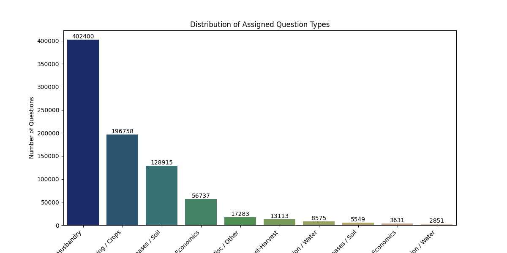
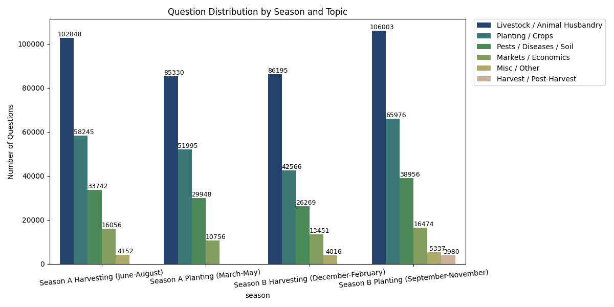
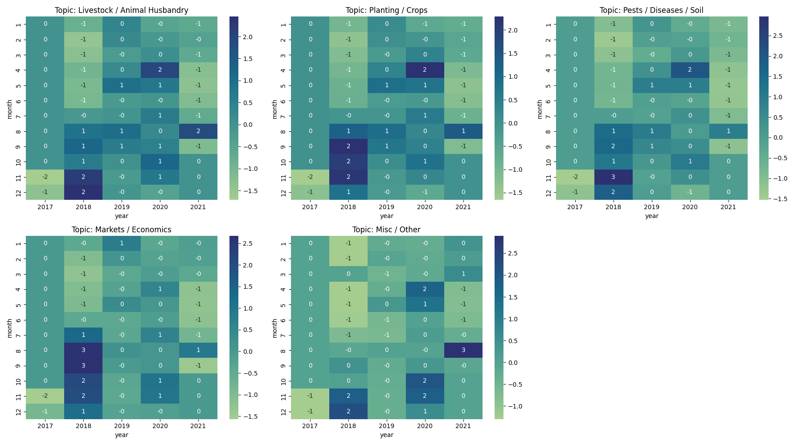
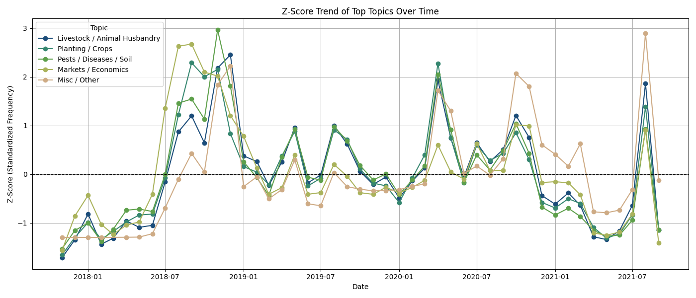

# Gina Kuszajewski - Challenge 2: Seasonality Analysis

## Overview
This analysis explores how farmers’ questions in Uganda fluctuate across seasons and months, with a focus on identifying whether question types (e.g., livestock, crops, pests, markets)  follow predictable seasonal patterns.

Understanding these patterns helps Producers Direct better anticipate farmer needs, improve resource planning, and identify emerging issues across the agricultural calendar.

## Research Questions
- How do question topics vary by season in Uganda?
   - Are certain crop or livestock topics concentrated in planting or harvesting periods?
- Do monthly patterns align with known agricultural seasons?
   - For example: Are crop questions clustering around planting or harvesting months?
- How have topic trends changed year-over-year?
   - Are some topics increasing in frequency, indicating shifting farmer priorities?

## Methodology

### Data Sources
Primary dataset: Producers Direct DataKit Q&A dataset (Uganda subset)
Reference materials: Uganda seasonal farming calendar provided by Producers Direct
Derived tables:
	topic-year-month frequency table
	top 10 topics per season
	normalized (Z-score) trends by topic

### Approach
### 1. Data Cleaning and Preprocessing
- Lowercase conversion and whitespace normalization
- Tokenization and removal of non-alphabetic tokens
- Stopword removal
- Deduplication of identical questions to remove spam or repeats
### 2. Topic Assignment

Predefined topics include:
- **Planting / Crops**
- **Harvest / Post-Harvest**
- **Pests / Diseases / Soil**
- **Irrigation / Water**
- **Livestock / Animal Husbandry**
- **Markets / Economics**
- **Technology / Equipment**
- **Policy / Finance**
Each question is matched to topics using keyword-based rules. Questions not matching any topic are classified as **Misc / Other**
### 3. Clustering Miscellaneous Questions
- TF-IDF vectorization is applied to miscellaneous questions.
- MiniBatch K-Means clustering groups similar questions into 10 clusters.
- Clusters are mapped back to main topics where possible.
### 4. Temporal Analysis
- Conversion of `question_sent` to datetime.
- Assignment of Uganda-specific planting/harvesting seasons
- Visualization of topic distributions by season, month, and year
- Standardized frequency (Z-score) trends of top topics over time
### 5. Topic Corrections
- Cross-checks are performed to ensure questions about crops or animals are correctly assigned
## Visualizations

- Distribution of Assigned Question Types
- Question Distribution by Season and Topic
- Heatmaps of Topic Frequency by Month and Year
- Z-Score Trend of Top Topics Over Time

### Tools and Technologies
- Programming Language: Python 3.11
- Libraries: pandas, numpy, matplotlib, seaborn, pyarrow, scikit-learn
- Development Tools: Jupyter Notebook
- GenAI Tools Used: ChatGPT (analysis guidance, troubleshooting code support, refactoring assistance)

## Use of Generative AI

### Tools Used
- **ChatGPT**: Helped debug plotting issues
  - Suggested visual design improvements

### Human Review Process
- All AI-generated code was reviewed and tested for accuracy
- AI-generated insights were validated against the data
- Modified AI suggestions in the following ways: 

### AI-Assisted vs. Human-Created
- AI-Assisted:
  - Visualization scaffolds
  - Troubleshooting error messages
  - Initial keyword clustering and code questions
  - Most base code (which was then altered and troubleshooted to fit the human’s research needs)
- Human-Created:
  - Topic selection and research direction
  - All analysis logic, conclusions, and final data interpretation
  - All data validation 
  - All final visualization design and parameter choices

## Key Findings

### Finding 1: Distribution of Assigned Question Types 

A bar chart of the top 10 question types based on keywords reveals that most questions are livestock-focused. Questions about crops and pests are present but account for less than half of livestock-related questions. Other top categories include interwoven topics, such as pests combined with crops.

**Implications for Producers Direct:**
- This shows that, for English-speaking Ugandan farmers, livestock management is the primary concern. According to the 2021 National Livestock Census, 6.8 million households in Uganda have at least one type of livestock, aligning with this trend.
- Producers Direct can prioritize livestock-related resources, training, and support in Uganda, while maintaining a smaller focus on crops and pests.

### Finding 2: Question Distribution by Season and Topic

Seasonal bar charts show how questions fluctuate across Uganda’s planting and harvesting periods. While the top three question types remain consistent, the number of questions varies: December–May (Season B harvesting and Season A planting) generally had fewer questions, whereas June–November saw higher engagement. Interestingly, harvesting-related questions peak in September–November, possibly reflecting preparation for the upcoming harvest.

**Implications for Producers Direct:**
Seasonal insights can inform the timing of content and training programs. For example, focusing on livestock and crop advice during June-November could maximize engagement
Resources and outreach efforts could be strategically aligned with periods when questions surge

### Finding 3: Heat Maps of the Top 5 Question Types Over Time

After Z-scoring to help keep popularity relative to each question type, these heat maps provide an excellent example of when spikes in each topic stood out over the years. Notable examples include a surge in markets and economics questions from August–November 2018, and a spike in miscellaneous questions in August 2021, likely related to app disruptions.

**Implications for Producers Direct:**
These temporal patterns highlight specific months when farmers need targeted guidance, which may correspond with weather events, planting/harvesting cycles, or platform issues
Livestock remains the most consistent topic overall, but some months (e.g., June and July) show generally lower engagement, suggesting opportunities to encourage participation or provide reminders during quieter periods

## Finding 4: Z-Score Trend of Topic Topics Over Time

Line plots of standardized topic frequencies make it easier to compare relative popularity and trends. For instance, markets and economics spiked first in late 2018, followed by pests and diseases, and then livestock. Miscellaneous questions began increasing in late 2020. Similar trends across topics suggest that different farmer concerns often follow a common temporal flow, despite differences in overall volume.
**Implications for Producers Direct:**
Understanding these trends can help anticipate farmer needs and adjust resource allocation throughout the year
This visualization can guide proactive planning, e.g., preparing content for anticipated spikes in livestock or market questions
## Limitations and Challenges

### Data Limitations
This analysis focuses only on English-language questions from Ugandan farmers, which may introduce bias. While this subset represented roughly 70% of all Ugandan questions—providing strong coverage—farmers who submit questions in Luganda or other local languages may exhibit different trends not captured here.
Data quality issues: Typos and misspellings were not corrected, which may have caused some questions to be misclassified as “Misc / Other.” Additionally, any questions containing null fields were removed, resulting in some data loss.

### Methodological Limitations
Keyword-based assumptions: Topic assignment relied on the presence of specific keywords. This assumes that questions containing those terms are genuinely about those topics, which may not always be true.
Necessary simplifications: Topic assignment was rule-based and did not incorporate more advanced NLP methods (e.g., semantic similarity or transformer-based classification).

Alternative approaches not explored:
Integrating historical rainfall and drought data to compare question volume with environmental conditions.
Including questions in all three major Ugandan languages to build multilingual comparisons.
Experimenting with additional visualization techniques or topic modeling algorithms (e.g., LDA, BERT).

### Technical Challenges
Computational constraints: The analysis was conducted on a 2019 MacBook Pro nearing end-of-life, resulting in slower processing, especially for clustering and TF-IDF steps.

## Next Steps and Recommendations

### For Further Analysis
1. **Investigate peak months for each topic more deeply.**:  For example: spikes in market-related questions in Aug–Sept 2018, pest-related spikes in Nov 2018, and the rise in miscellaneous questions in late 2020
2. **Analyze multi-topic or “interwoven” questions**: Identify recurring phrasing, overlapping keywords, and whether certain multi-topic patterns can be collapsed into a unified topic category
3. **Expand livestock-focused analysis**: Since livestock questions dominate, conduct deeper dives into subthemes: common diseases, feeding challenges, housing, and livestock-specific seasonal patterns

### For Producers Direct
1. **Align program content with demonstrated farmer demand**: Livestock management emerges as the primary concern among Ugandan farmers in this dataset. Producers Direct can use this insight to:
Prioritize livestock-focused training modules and peer-leader development
Identify farmers already demonstrating expertise in livestock topics to serve as local knowledge leaders within the Global Cooperative
2. **Use seasonal and temporal trends to optimize information delivery**: Peaks in certain question types during specific planting/harvesting periods suggest that timing matters. Producers Direct can use seasonal patterns to:
Schedule targeted advisory campaigns in high-demand months.
Pilot or test different dissemination models (P2P, top-down expert-driven, or hub-and-spoke) during these peak periods to see which structure farmers trust and engage with most
3. **Strengthen multilingual and multi-region data integration**:  To fulfill the vision of a farmer-led global data network, Producers Direct could:
Expand this analysis to include translated questions from Luganda and other local languages
Compare patterns across regions (using region specific keywords within Uganda) to identify universal vs. location-specific needs
Incorporate structured data (weather, input prices, disease reports) to enrich insights and support more accurate forecasting models

## Files in This Contribution

```
gina_kuszajewski_analysis/
├── README.md (this file)
│   ├── GinaK-challenge2-Uganda.ipynb
|   |── plot1.png
|   |── plot2.png
|   |── plot3.png
|   |── plot4.png
```

## How to Run This Analysis

### Prerequisites
```bash
pip install pandas numpy nltk scikit-learn gensim matplotlib seaborn tensorflow
```

### Running the Analysis
```bash
# Navigate to the notebooks folder
cd notebooks/

# Start Jupyter Notebook
jupyter notebook

# Open and run notebook: 
# 1. GinaK-challenge2-Uganda.ipynb 
```

## References and Resources

### Datasets
- Dataset Name. Source. URL not entered out of respect for Producers Direct.

### Tools and Libraries
- Library Name. Version. URL.

## Contact and Collaboration

**Author**: Gina Kuszajewski
**GitHub**: @reginakusza
**Slack**: @Gina Kuszajewski 

**Collaboration Welcome**: 
- Open to feedback and suggestions
- Happy to collaborate on related analyses
- Available to answer questions about this approach

## Acknowledgments

- Built upon work by Tebas Martinez

---

**Last Updated**: 11/21/25 
**Status**: Needs Review

